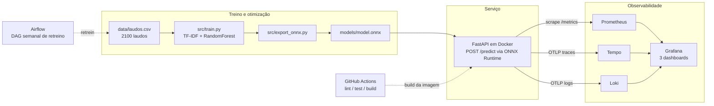
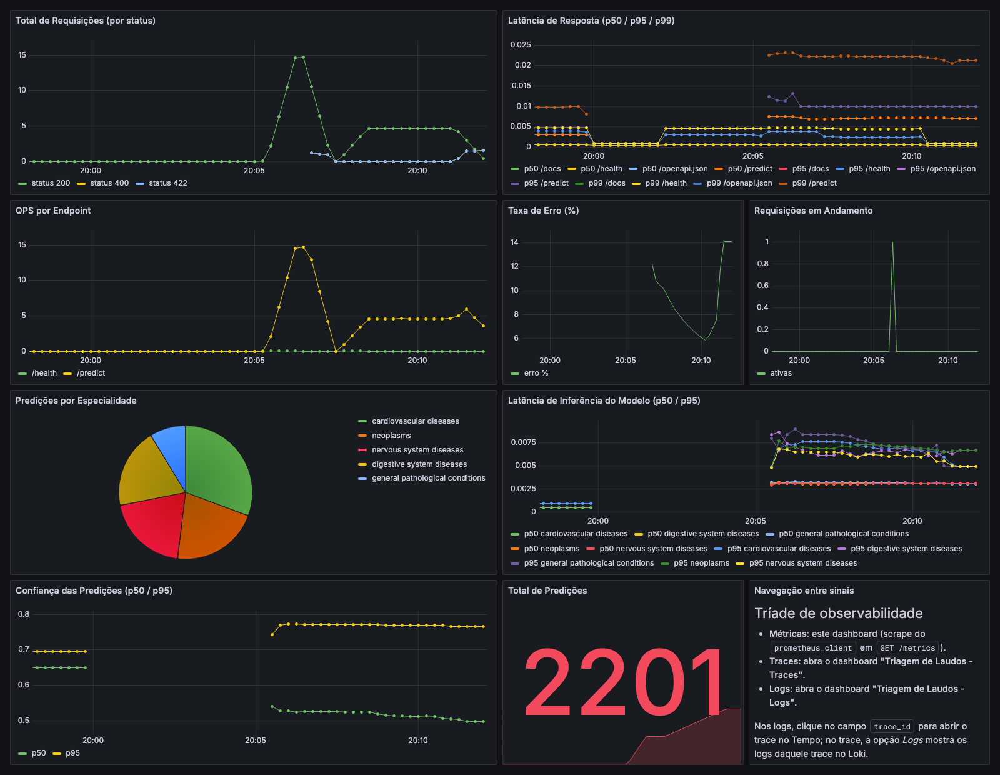
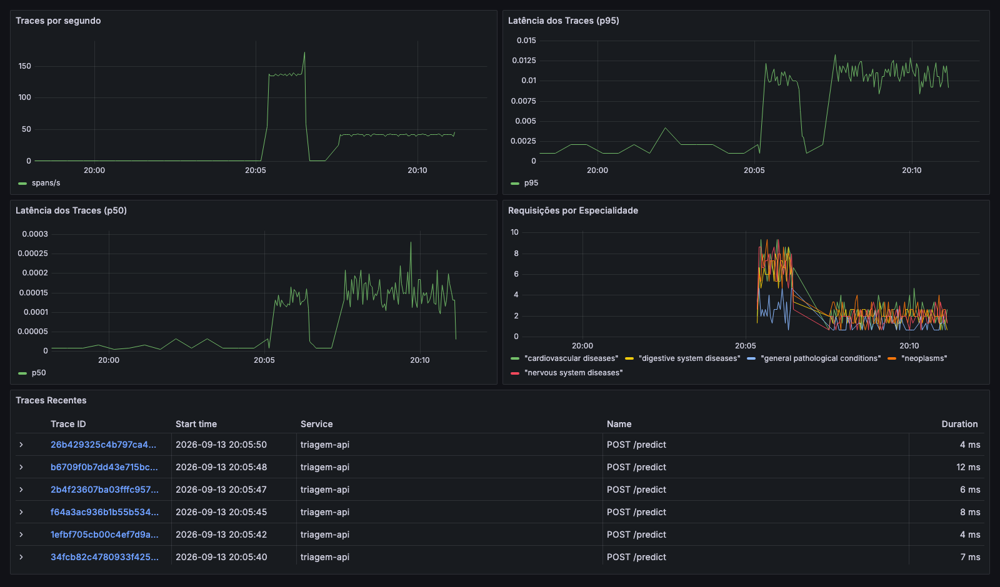
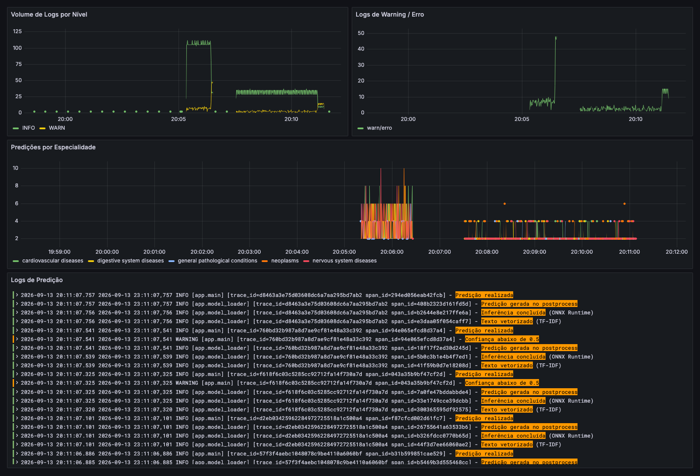
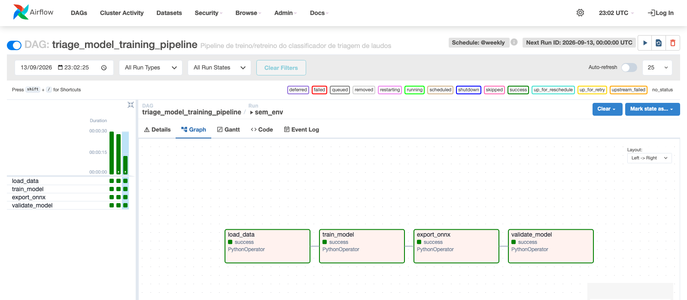

# Triagem Automática de Laudos Médicos

Projeto do Tech Challenge Fase 3 (FIAP MLET). Um classificador de texto leve, servido por uma
API REST em container, com pipeline CI/CD, orquestração de retreino, observabilidade completa e
otimização de latência.



---

## Links

| O quê | Onde |
|---|---|
| Vídeo STAR (até 5 min) | _a preencher_ |
| Documentação interativa da API | http://localhost:8000/docs (após `make up`) |
| Dashboards do Grafana | http://localhost:3000 (após `make up`) |
| Airflow | http://localhost:8080 (após `make airflow-up`) |
| Resultados de latência | [`docs/benchmark.txt`](docs/benchmark.txt) |
| Evidências visuais | [`docs/`](docs/): 3 prints de dashboard e o print da DAG |

---

## Mapeamento dos critérios de avaliação

| Critério | Peso | Onde está |
|---|---|---|
| Modelagem e Otimização | 20% | [seção 5](#5-otimização-de-latência), `src/train.py`, `src/export_onnx.py`, `docs/benchmark.txt` |
| CI/CD (GitHub Actions) | 15% | [seção 7](#7-cicd-github-actions), `.github/workflows/ci.yml` |
| Orquestração (Airflow) | 15% | [seção 8](#8-orquestração-de-retreino-airflow), `airflow/dags/triage_training_dag.py`, `docs/airflow_dag.png` |
| Monitoramento | 20% | [seção 6](#6-observabilidade), `docker/docker-compose.yml`, `docker/grafana/dashboards/` |
| Documentação (README) | 15% | [seção 2](#2-arquitetura-de-deploy-em-nuvem) (decisão de nuvem) e [seção 3](#3-como-executar) (execução) |
| Vídeo STAR | 15% | [seção 11](#11-vídeo-star) |

---

## 1. Visão geral

Um hospital de referência recebe laudos e relatos de sintomas em texto livre e precisa priorizar
o atendimento. O sistema classifica cada laudo em uma de três classes de urgência:

| Classe | Significado | Exemplo de laudo |
|---|---|---|
| `normal` | Sem necessidade de intervenção | "Hemograma completo dentro da normalidade, sem sinais de infecção." |
| `atencao` | Requer acompanhamento | "Pressão arterial levemente elevada, recomendado acompanhamento." |
| `urgente` | Requer atendimento imediato | "Paciente com febre alta e rigidez de nuca, suspeita de meningite." |

**Modelo:** TF-IDF (`max_features=3000`, n-gramas 1 a 2) seguido de `RandomForestClassifier`
(200 árvores, `max_depth=20`), treinado com `scikit-learn` sobre 2100 laudos balanceados.
O classificador é exportado para ONNX e servido pelo ONNX Runtime, que é o backend padrão da API.

**Stack:** FastAPI, ONNX Runtime, Docker Compose, Prometheus, Grafana, Tempo, Loki, Airflow e
GitHub Actions.

---

## 2. Arquitetura de deploy em nuvem

### Batch ou real-time?

A triagem existe para decidir a ordem de atendimento **enquanto o paciente está no hospital**.
Um lote noturno entregaria a classificação depois que a decisão já foi tomada, o que anula o
propósito do sistema. O requisito é, portanto, **inferência real-time (síncrona)**: uma chamada
HTTP por laudo, com resposta em poucos milissegundos.

O volume ajuda a fechar a decisão: um hospital de referência gera dezenas a centenas de laudos por
hora, não milhões. É carga baixa e contínua, com picos previsíveis nos horários de pico do
pronto-socorro. Isso pede um serviço pequeno sempre de pé, não um cluster elástico.

### Recomendação: AWS ECS Fargate + Application Load Balancer

```
                       +---------------------------+
                       |   Sistema hospitalar       |
                       |   (HIS / prontuário)       |
                       +-------------+-------------+
                                     | HTTPS POST /predict
                                     v
                       +---------------------------+
                       |  Application Load Balancer |
                       |  (health check em /health) |
                       +-------------+-------------+
                                     |
                     +---------------+---------------+
                     |                               |
             +-------v-------+               +-------v-------+
             | ECS Fargate   |               | ECS Fargate   |
             | task (API)    |     ...       | task (API)    |
             | imagem do ECR |               | imagem do ECR |
             +---+-------+---+               +---+-------+---+
                 |       |                       |       |
        /metrics |       | OTLP (traces e logs)  |       |
                 v       v                       v       v
        +--------+--+  +-+---------------------+-+  +----+-------+
        | Amazon    |  | AWS Distro for        |   | Amazon      |
        | Managed   |  | OpenTelemetry (ADOT)  |   | CloudWatch  |
        | Prometheus|  | -> X-Ray / CloudWatch |   | Logs        |
        +-----+-----+  +-----------------------+   +-------------+
              |
              v
        +-----+---------------+          +------------------------+
        | Amazon Managed      |          | S3: artefatos do modelo |
        | Grafana (dashboards)|          | (model.onnx, vectorizer)|
        +---------------------+          +------------+------------+
                                                      ^
                                                      | escreve o novo modelo
                                         +------------+------------+
                                         | Amazon MWAA (Airflow)   |
                                         | DAG semanal de retreino |
                                         +-------------------------+
```

**Por que ECS Fargate:** a imagem Docker do serviço já existe e roda igual em qualquer lugar; o
Fargate a executa sem nenhum servidor para provisionar, corrigir ou escalar manualmente. Os artefatos
do modelo somam menos de 1.5 MB e carregam em memória no start, então uma task com 0.5 vCPU e 1 GB
atende com folga, e o autoscaling por número de requisições cobre os picos. O ALB entrega TLS, health check em `/health`
e distribuição entre tasks sem código adicional.

**Alternativas descartadas:**

- **AWS Lambda:** cold start com `onnxruntime` e `scikit-learn` no pacote custa centenas de
  milissegundos, o que anula o ganho de latência que este projeto foi otimizar.
- **SageMaker Endpoint:** custo e complexidade operacional desproporcionais para um RandomForest de
  200 árvores; faz sentido para modelos grandes com GPU, não para este.
- **EKS:** o overhead de operar um cluster Kubernetes não se paga para um único serviço stateless.
- **Batch (S3 + AWS Batch / Glue):** descartado pelo requisito de negócio, conforme acima.

**Componentes de apoio:**

- **ECR** guarda a imagem; o job de build do CI já produz exatamente essa imagem e só precisaria de
  um passo de `push` com credenciais OIDC.
- **S3** guarda os artefatos do modelo (`model.onnx`, `tfidf_vectorizer.joblib`, `classes.json`),
  versionados. Hoje eles são copiados para dentro da imagem no build; em nuvem o retreino publica
  no S3 e a task busca no start, o que desacopla o ciclo do modelo do ciclo do código.
- **Amazon Managed Prometheus + Amazon Managed Grafana** recebem os mesmos sinais da stack local.
  A API expõe métricas no formato de exposição do Prometheus e envia traces e logs por OTLP puro,
  que é o protocolo que o ADOT Collector fala nativamente, então **a migração não exige mudança de
  código**, apenas de endpoint.
- **Amazon MWAA** executa a mesma DAG de retreino sem alteração.

---

## 3. Como executar

Pré-requisitos: Docker (com o daemon rodando, usado inclusive pelos lints), `uv` e Python 3.11.

```bash
make setup    # cria o .venv com Python 3.11 e instala todas as dependências
make model    # gera o dataset sintético, treina e exporta para ONNX
make check    # lint (flake8 + hadolint + DCLint + ty) e pytest, o mesmo que o CI roda
make up       # sobe a stack completa: API + Prometheus + Grafana + Tempo + Loki
```

Serviços após o `make up`:

| Serviço | URL | Observação |
|---|---|---|
| API | http://localhost:8000 | docs interativas em `/docs` |
| Prometheus | http://localhost:9090 | alvo `triagem-api` em `/targets` |
| Grafana | http://localhost:3000 | `admin` / `admin`, ou acesso anônimo somente leitura |
| Tempo | http://localhost:3200 | consultado pelo Grafana, não pelo navegador |
| Loki | http://localhost:3100 | consultado pelo Grafana, não pelo navegador |

Demais alvos:

```bash
make bench        # latência do classificador e da API HTTP (exige a stack de pé)
make airflow-up   # sobe o Airflow standalone em http://localhost:8080 (UI sem login)
make airflow-down # derruba o Airflow
make down         # derruba a stack de observabilidade
make help         # lista todos os alvos
```

Para popular os dashboards com tráfego realista:

```bash
.venv/bin/python scripts/populate_dashboards.py --n 300
```

---

## 4. API

### `POST /predict`

```bash
curl -s -X POST localhost:8000/predict \
  -H 'Content-Type: application/json' \
  -d '{"texto": "Paciente com dor toracica intensa e falta de ar, suspeita de infarto agudo do miocardio."}'
```

```json
{
  "classificacao": "urgente",
  "confianca": 0.9050000309944153,
  "probabilidades": {
    "atencao": 0.07999999821186066,
    "normal": 0.014999999664723873,
    "urgente": 0.9050000309944153
  },
  "modelo": "onnx",
  "latencia_ms": 1.375
}
```

O campo `latencia_ms` mede apenas TF-IDF mais classificador, sem o custo de HTTP.

### `GET /health`

```bash
curl -s localhost:8000/health
# {"status":"ok","modelo":"onnx"}
```

### `GET /metrics`

Formato de exposição do Prometheus, gerado pelo `prometheus_client`. É o alvo do scrape.

### Erros

| Situação | Status |
|---|---|
| `texto` com menos de 3 caracteres ou campo ausente | `422` (validação do Pydantic) |
| `texto` só com espaços | `400` |

O backend de inferência é escolhido pela variável `MODEL_BACKEND` (`onnx`, o padrão, ou `sklearn`).

---

## 5. Otimização de latência

A técnica aplicada foi a **conversão do classificador para ONNX e a inferência via ONNX Runtime**.

**Por que só o classificador foi para ONNX:** converter o `TfidfVectorizer` inteiro traz o operador
`StringNormalizer`, que depende de locale do sistema operacional e falha em imagens Docker mínimas,
um problema conhecido do onnxruntime. O TF-IDF continua em Python e apenas o RandomForest, que é o
componente computacionalmente caro, vai para ONNX. A justificativa completa está em
`src/export_onnx.py`.

Medições em `docs/benchmark.txt` (macOS, Apple M5, Python 3.11, onnxruntime 1.19.2), reprodutíveis
com `make bench`:

**Escopo 1: classificador isolado** (1 amostra, 500 execuções)

| Backend | Latência média | Ganho |
|---|---|---|
| sklearn RandomForest, `n_jobs=1` | 1.3174 ms | baseline |
| ONNX Runtime | 0.0065 ms | **204x mais rápido** |
| sklearn RandomForest, `n_jobs=-1` | 13.3068 ms | 2058x (nota de rodapé) |

A baseline honesta é `n_jobs=1`. Com `n_jobs=-1`, que é a configuração real do treino, quase todo o
tempo é despacho de threads do joblib e não trabalho do modelo, o que infla o ganho por um motivo
que não tem relação com a otimização.

**Escopo 2: HTTP end-to-end**, API em Docker (200 requisições)

| Backend | Cliente média | p50 | p95 | Servidor média | Modelo média |
|---|---|---|---|---|---|
| sklearn | 14.1439 ms | 13.9757 ms | 15.3033 ms | 13.2080 ms | 12.7522 ms |
| onnx | 2.4609 ms | 2.0334 ms | 4.1713 ms | 1.3065 ms | 0.1801 ms |

**Ganho end-to-end: 82.6%, ou 5.7x mais rápido.**

O ganho de 5.7x é menor que os 204x do classificador isolado, e isso é o resultado esperado: a
otimização **move o gargalo**. Com sklearn o modelo consome 90.2% do tempo do cliente; com ONNX cai
para 7.3%, e o que sobra é a camada HTTP mais o custo dos três sinais de observabilidade por
requisição.

---

## 6. Observabilidade

A API emite três sinais:

| Sinal | Como | Destino |
|---|---|---|
| Métricas | `prometheus_client` em `GET /metrics` | Prometheus (scrape a cada 5s) |
| Traces | OpenTelemetry, instrumentação automática do FastAPI mais um span manual `predict` | Tempo (OTLP/HTTP) |
| Logs | `logging` do Python com `trace_id` e `span_id` correlacionados | Loki (OTLP/HTTP) |

**Decisão:** métricas ficaram integralmente com o `prometheus_client`, citado nominalmente no
enunciado, e o OpenTelemetry ficou apenas com traces e logs. Assim existe **um** caminho de
métricas, e o nome de cada série é literalmente o que está escrito em `src/app/main.py`. O
middleware ignora o próprio `/metrics` para o scrape não se autocontabilizar, e o
`FastAPIInstrumentor` recebe `excluded_urls="metrics"` para que o scrape não vire trace no Tempo.

Séries expostas: `http_requests_total`, `http_errors_total`, `http_request_duration_seconds`,
`http_server_active_requests`, `predictions_total`, `model_predict_duration_seconds` e
`model_predict_confidence`. `tests/test_metrics.py` garante que nenhuma delas suma numa renomeação
silenciosa e derrube um painel.

São 3 dashboards provisionados automaticamente, 19 painéis no total.

### Métricas da API (10 painéis)

Total de requisições por status, latência p50/p95/p99, QPS por endpoint, taxa de erro, requisições
em andamento, predições por classe, latência de inferência, confiança das predições e total de
predições.



### Traces (5 painéis)



### Logs (4 painéis)



Os dashboards são provisionados por `docker/grafana/provisioning/`, então sobem prontos com o
`make up`. Os JSONs estão em `docker/grafana/dashboards/`.

---

## 7. CI/CD (GitHub Actions)

`.github/workflows/ci.yml` dispara em push para `main` e `develop` e em pull request para `main`,
com três jobs encadeados (`lint` -> `test` -> `build`):

| Job | O que faz |
|---|---|
| **lint** | flake8 (Python), hadolint (Dockerfile), DCLint (os dois composes) e `ty` (validação estática de anotações de tipo) |
| **test** | gera o dataset, treina o modelo e roda o pytest (10 testes) |
| **build** | reconstrói os artefatos e gera a imagem Docker com tag `${{ github.sha }}`, sem publicar |

O CI reaproveita os mesmos alvos do `Makefile` usados localmente (`make ci-install PY=python`,
`make lint-python`, `make test`, `make build`), então `make check` na máquina reproduz exatamente o
que roda no runner.

---

## 8. Orquestração de retreino (Airflow)

A DAG `triage_model_training_pipeline` (`airflow/dags/triage_training_dag.py`) tem
`schedule="@weekly"` e quatro tasks sequenciais:

```
load_data  ->  train_model  ->  export_onnx  ->  validate_model
```

| Task | O que faz |
|---|---|
| `load_data` | gera/carrega o CSV de treino em `data/laudos.csv` |
| `train_model` | treina o pipeline TF-IDF + RandomForest e salva `models/model.joblib` |
| `export_onnx` | converte o classificador para `models/model.onnx` |
| `validate_model` | falha a DAG se qualquer um dos quatro artefatos não tiver sido gerado |

```bash
make airflow-up   # http://localhost:8080, UI sem login
```

O compose (`docker/docker-compose.airflow.yml`) sobe o Airflow em modo `standalone` e monta o
repositório em `/opt/airflow/project`, então os artefatos gerados pelas tasks aparecem direto em
`models/` no host. As quatro tasks concluem em cerca de 6 segundos:



O `validate_model` é o portão de qualidade do pipeline: sem os quatro artefatos, nada é liberado
para a API.

---

## 9. Dataset

`data/laudos.csv`: **2100 laudos**, perfeitamente balanceados em 700 por classe, gerados por
`data/generate_data.py` com `random.seed(42)`.

**Por que sintético:** o projeto roda de ponta a ponta sem credencial de Kaggle e sem download
externo, o que mantém o CI e a DAG do Airflow reprodutíveis em qualquer máquina. O gerador combina
10 templates de laudo por classe com 7 sufixos de contexto (idade, sexo, encaminhamento,
histórico).

**Consequência que precisa ser dita:** o treino reporta f1 de 1.00 nas três classes. Isso mede o
pipeline, não a capacidade de generalização, e é o resultado inevitável de dados construídos a
partir de templates. Nenhuma conclusão clínica deve ser tirada desse número.

**Como trocar por um dataset real:** basta substituir `data/laudos.csv` por um CSV com as mesmas
duas colunas, `texto` e `label` (`normal` | `atencao` | `urgente`), e rodar `make model`. Nenhuma
outra alteração é necessária. Candidatos: Medical Abstracts TC Corpus (Kaggle) ou recortes do
MIMIC-III.

---

## 10. Estrutura do repositório

```
.
├── .github/workflows/ci.yml          pipeline de CI (lint -> test -> build)
├── airflow/dags/                     DAG de retreino (load -> train -> export -> validate)
├── data/
│   ├── generate_data.py              gerador do dataset sintético
│   └── laudos.csv                    2100 laudos, 700 por classe
├── docker/
│   ├── Dockerfile                    imagem da API (python:3.11-slim)
│   ├── docker-compose.yml            API + Prometheus + Grafana + Tempo + Loki
│   ├── docker-compose.airflow.yml    Airflow standalone (só para demonstrar a DAG)
│   ├── prometheus.yml                scrape de api:8000/metrics
│   ├── tempo.yml / loki-config.yml   backends de traces e logs
│   └── grafana/                      datasources e os 3 dashboards provisionados
├── docs/                             benchmark e prints (dashboards e DAG)
├── models/                           artefatos: .joblib, .onnx, vectorizer, classes.json
├── scripts/populate_dashboards.py    gerador de tráfego para popular os painéis
├── src/
│   ├── app/                          API FastAPI: main, model_loader, schemas, telemetry
│   ├── train.py                      treino do pipeline TF-IDF + RandomForest
│   ├── export_onnx.py                conversão do classificador para ONNX
│   ├── benchmark.py                  latência do classificador isolado
│   └── benchmark_http.py             latência HTTP end-to-end
├── tests/                            pytest: API, artefatos, métricas, telemetria
├── Makefile                          todos os atalhos (make help)
└── requirements*.txt                 dependências (a da API é enxuta, sem treino)
```

`requirements-api.txt` é intencionalmente menor que `requirements.txt`: a imagem da API não precisa
de `pandas`, `skl2onnx` nem das ferramentas de treino, apenas do necessário para servir.

---

## 11. Vídeo STAR

Link: _a preencher_

Roteiro (formato STAR, até 5 minutos): a situação da triagem manual, a tarefa de colocar o modelo
em produção, as ações demonstradas ao vivo (API, dashboards, CI verde, DAG e a tabela de latência)
e o resultado medido.
