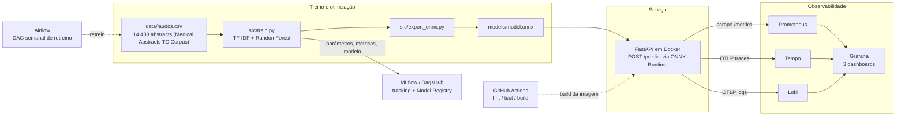

# Triagem de Laudos por Especialidade

Projeto do Tech Challenge Fase 3 (FIAP MLET). Um hospital de referência recebe laudos e textos
clínicos o dia inteiro e precisa encaminhar cada um para a fila da especialidade certa
(cardiologia, gastroenterologia, clínica geral, oncologia ou neurologia) assim que ele chega. Um
classificador de texto leve faz esse roteamento, servido por uma API REST em container, com
pipeline CI/CD, orquestração de retreino, observabilidade completa e otimização de latência.

**Por que especialidade e não urgência:** o enunciado aceita "classificação/urgência" como target e
sugere nominalmente o **Medical Abstracts TC Corpus**, que é rotulado por condição médica, e não por
grau de urgência. Derivar urgência a partir da condição seria medicamente arbitrário, então o
projeto usa o rótulo real do corpus e trata a triagem como **roteamento por especialidade**. Todo o
restante do enunciado (API real-time, CI/CD, Airflow, monitoramento e otimização de latência)
se aplica sem mudança.



---

## Links

| O quê | Onde |
|---|---|
| Vídeo STAR (até 5 min) | https://www.youtube.com/watch?v=rE5LJOkbW9E |
| Documentação interativa da API | http://localhost:8000/docs (após `make up`) |
| Dashboards do Grafana | http://localhost:3000 (após `make up`) |
| Airflow | http://localhost:8080 (após `make airflow-up`) |
| Resultados de latência | [`docs/benchmark.txt`](docs/benchmark.txt) |
| Evidências visuais | [`docs/`](docs/): 3 prints de dashboard e o print da DAG |

---

## Mapeamento dos critérios de avaliação

| Critério | Peso | Onde está |
|---|---|---|
| Modelagem e Otimização | 20% | [seção 5](#5-otimização-de-latência) (latência), [seção 9](#9-dataset-e-qualidade-do-modelo) (qualidade), `src/train.py`, `src/export_onnx.py`, `docs/benchmark.txt` |
| CI/CD (GitHub Actions) | 15% | [seção 7](#7-cicd-github-actions), `.github/workflows/ci.yml` |
| Orquestração (Airflow) | 15% | [seção 8](#8-orquestração-de-retreino-airflow), `airflow/dags/triage_training_dag.py`, `docs/airflow_dag.png`; registro das versões em [seção 11](#11-mlflow--dagshub-model-registry) |
| Monitoramento | 20% | [seção 6](#6-observabilidade), `docker/docker-compose.yml`, `docker/grafana/dashboards/` |
| Documentação (README) | 15% | [seção 2](#2-arquitetura-de-deploy-em-nuvem) (decisão de nuvem) e [seção 3](#3-como-executar) (execução) |
| Vídeo STAR | 15% | [seção 12](#12-vídeo-star) |

---

## 1. Visão geral

O sistema recebe o texto de um laudo (em inglês, como o corpus de treino) e devolve a condição
médica predominante, que define a fila de destino. As classes são as cinco do **Medical Abstracts
TC Corpus**:

| Classe | Significado | Fila de destino |
|---|---|---|
| `cardiovascular diseases` | Doenças cardiovasculares | Cardiologia |
| `digestive system diseases` | Doenças do sistema digestivo | Gastroenterologia |
| `general pathological conditions` | Condições patológicas gerais | Clínica geral |
| `neoplasms` | Neoplasias | Oncologia |
| `nervous system diseases` | Doenças do sistema nervoso | Neurologia |

**Modelo:** TF-IDF (`max_features=5000`, n-gramas 1 a 2) seguido de `RandomForestClassifier`
(100 árvores, sem limite de profundidade, `min_samples_leaf=10`, `class_weight="balanced"`),
treinado com `scikit-learn` sobre 14.438 abstracts reais (accuracy e f1_macro de 0.59, ver
[seção 9](#9-dataset-e-qualidade-do-modelo)). O classificador é exportado para ONNX e servido pelo
ONNX Runtime, que é o backend padrão da API.

**Stack:** FastAPI, ONNX Runtime, Docker Compose, Prometheus, Grafana, Tempo, Loki, Airflow,
MLflow com DagsHub (tracking e Model Registry) e GitHub Actions.

---

## 2. Arquitetura de deploy em nuvem

### Batch ou real-time?

A triagem existe para colocar cada laudo **na fila da especialidade certa no momento em que ele é
emitido**, para que o especialista comece a análise sem depender de uma leitura manual de
roteamento. Um lote noturno deixaria os laudos do dia parados sem destino até a manhã seguinte,
justamente o atraso que o sistema deveria eliminar. O requisito é, portanto, **inferência
real-time (síncrona)**: o sistema hospitalar faz uma chamada HTTP por laudo e recebe a
especialidade em poucos milissegundos.

O volume ajuda a fechar a decisão: um hospital de referência gera dezenas a centenas de laudos por
hora, não milhões. É carga baixa e contínua, com picos previsíveis nos horários de maior movimento.
Isso pede um serviço pequeno sempre de pé, não um cluster elástico.

### Recomendação: AWS ECS Fargate + Application Load Balancer

```
                       +---------------------------+
                       |   Sistema hospitalar       |
                       |   (HIS / prontuário)       |
                       +-------------+-------------+
                                     | HTTPS POST /predict
                                     v
                       +---------------------------+
                       |  Application Load Balancer |
                       |  (health check em /health) |
                       +-------------+-------------+
                                     |
                     +---------------+---------------+
                     |                               |
             +-------v-------+               +-------v-------+
             | ECS Fargate   |               | ECS Fargate   |
             | task (API)    |     ...       | task (API)    |
             | imagem do ECR |               | imagem do ECR |
             +---+-------+---+               +---+-------+---+
                 |       |                       |       |
        /metrics |       | OTLP (traces e logs)  |       |
                 v       v                       v       v
        +--------+--+  +-+---------------------+-+  +----+-------+
        | Amazon    |  | AWS Distro for        |   | Amazon      |
        | Managed   |  | OpenTelemetry (ADOT)  |   | CloudWatch  |
        | Prometheus|  | -> X-Ray / CloudWatch |   | Logs        |
        +-----+-----+  +-----------------------+   +-------------+
              |
              v
        +-----+---------------+          +------------------------+
        | Amazon Managed      |          | S3: artefatos do modelo |
        | Grafana (dashboards)|          | (model.onnx, vectorizer)|
        +---------------------+          +------------+------------+
                                                      ^
                                                      | escreve o novo modelo
                                         +------------+------------+
                                         | Amazon MWAA (Airflow)   |
                                         | DAG semanal de retreino |
                                         +-------------------------+
```

**Por que ECS Fargate:** a imagem Docker do serviço já existe e roda igual em qualquer lugar; o
Fargate a executa sem nenhum servidor para provisionar, corrigir ou escalar manualmente. Os artefatos
do modelo carregados pelo backend ONNX (`model.onnx` e `tfidf_vectorizer.joblib`) somam cerca de
5 MB e carregam em memória no start, então uma task com 0.5 vCPU e 1 GB
atende com folga, e o autoscaling por número de requisições cobre os picos. O ALB entrega TLS, health check em `/health`
e distribuição entre tasks sem código adicional.

**Alternativas descartadas:**

- **AWS Lambda:** cold start com `onnxruntime` e `scikit-learn` no pacote custa centenas de
  milissegundos, o que anula o ganho de latência que este projeto foi otimizar.
- **SageMaker Endpoint:** custo e complexidade operacional desproporcionais para um RandomForest de
  100 árvores; faz sentido para modelos grandes com GPU, não para este.
- **EKS:** o overhead de operar um cluster Kubernetes não se paga para um único serviço stateless.
- **Batch (S3 + AWS Batch / Glue):** descartado pelo requisito de negócio, conforme acima.

**Componentes de apoio:**

- **ECR** guarda a imagem; o job de build do CI já produz exatamente essa imagem e só precisaria de
  um passo de `push` com credenciais OIDC.
- **S3** guarda os artefatos do modelo (`model.onnx`, `tfidf_vectorizer.joblib`, `classes.json`),
  versionados. Hoje eles são copiados para dentro da imagem no build; em nuvem o retreino publica
  no S3 e a task busca no start, o que desacopla o ciclo do modelo do ciclo do código.
- **Amazon Managed Prometheus + Amazon Managed Grafana** recebem os mesmos sinais da stack local.
  A API expõe métricas no formato de exposição do Prometheus e envia traces e logs por OTLP puro,
  que é o protocolo que o ADOT Collector fala nativamente, então **a migração não exige mudança de
  código**, apenas de endpoint.
- **Amazon MWAA** executa a mesma DAG de retreino sem alteração.

---

## 3. Como executar

Pré-requisitos: Docker (com o daemon rodando, usado inclusive pelos lints), `uv` e Python 3.11.

```bash
make setup    # cria o .venv com Python 3.11 e instala todas as dependências
make model    # baixa o dataset (exige internet), treina e exporta para ONNX
make check    # lint (flake8 + hadolint + DCLint + ty) e pytest, o mesmo que o CI roda
make up       # sobe a stack completa: API + Prometheus + Grafana + Tempo + Loki
```

Serviços após o `make up`:

| Serviço | URL | Observação |
|---|---|---|
| API | http://localhost:8000 | docs interativas em `/docs` |
| Prometheus | http://localhost:9090 | alvo `triagem-api` em `/targets` |
| Grafana | http://localhost:3000 | `admin` / `admin`, ou acesso anônimo somente leitura |
| Tempo | http://localhost:3200 | consultado pelo Grafana, não pelo navegador |
| Loki | http://localhost:3100 | consultado pelo Grafana, não pelo navegador |

Demais alvos:

```bash
make bench        # latência do classificador e da API HTTP (exige a stack de pé)
make airflow-up   # sobe o Airflow standalone em http://localhost:8080 (UI sem login)
make airflow-down # derruba o Airflow
make down         # derruba a stack de observabilidade
make help         # lista todos os alvos
```

Para popular os dashboards com tráfego realista (abstracts reais das 5 classes, exige a stack de pé):

```bash
make populate          # 300 predições
make populate N=1000   # mais tráfego
```

O script também envia de propósito payloads inválidos (cerca de 1 a cada 6 predições) para que os
painéis de erro tenham dado.

---

## 4. API

### `POST /predict`

```bash
curl -s -X POST localhost:8000/predict \
  -H 'Content-Type: application/json' \
  -d '{"texto": "Patient presents with acute chest pain radiating to left arm, shortness of breath, and diaphoresis. ECG shows ST elevation in leads V1-V4. Troponin markedly elevated. Clinical picture consistent with acute anterior myocardial infarction."}'
```

Resposta literal da stack local (2026-09-13, modelo em `models/`, formatada para leitura):

```json
{
  "classificacao": "cardiovascular diseases",
  "confianca": 0.5870566368103027,
  "probabilidades": {
    "cardiovascular diseases": 0.5870566368103027,
    "digestive system diseases": 0.03426913917064667,
    "general pathological conditions": 0.19747069478034973,
    "neoplasms": 0.028771232813596725,
    "nervous system diseases": 0.15243232250213623
  },
  "modelo": "onnx",
  "latencia_ms": 1.4042
}
```

O laudo vai para a fila de cardiologia. O campo `latencia_ms` mede apenas TF-IDF mais
classificador, sem o custo de HTTP, e varia entre chamadas; as probabilidades são determinísticas
para o mesmo modelo.

### `GET /health`

```bash
curl -s localhost:8000/health
# {"status":"ok","modelo":"onnx"}
```

### `GET /metrics`

Formato de exposição do Prometheus, gerado pelo `prometheus_client`. É o alvo do scrape.

### Erros

| Situação | Status |
|---|---|
| `texto` com menos de 3 caracteres ou campo ausente | `422` (validação do Pydantic) |
| `texto` só com espaços | `400` |

O backend de inferência é escolhido pela variável `MODEL_BACKEND` (`onnx`, o padrão, ou `sklearn`).

---

## 5. Otimização de latência

A técnica aplicada foi a **conversão do classificador para ONNX e a inferência via ONNX Runtime**.

**Por que só o classificador foi para ONNX:** converter o `TfidfVectorizer` inteiro traz o operador
`StringNormalizer`, que depende de locale do sistema operacional e falha em imagens Docker mínimas,
um problema conhecido do onnxruntime. O TF-IDF continua em Python e apenas o RandomForest, que é o
componente computacionalmente caro, vai para ONNX. A justificativa completa está em
`src/export_onnx.py`.

Medições em `docs/benchmark.txt`, feitas em 2026-09-13 com o modelo final, reprodutíveis com
`make bench`. Ambiente: macOS 26.5.1 (Apple M5, 10 núcleos, 16 GB), Python 3.11, onnxruntime
1.19.2, scikit-learn 1.5.2; no escopo 2 a API roda em Docker Desktop 29.5.3. A entrada é um abstract
real de `cardiovascular diseases` do corpus, com 1.161 caracteres (mediana do corpus: 1.210),
definido em `SAMPLE_TEXT` (`src/benchmark_http.py`).

**Escopo 1: classificador isolado** (1 amostra, 500 execuções)

| Backend | Latência média | Ganho |
|---|---|---|
| sklearn RandomForest, `n_jobs=1` | 0.7310 ms | baseline |
| ONNX Runtime | 0.0068 ms | **108x mais rápido** |
| sklearn RandomForest, `n_jobs=-1` | 14.1200 ms | 2086x (nota de rodapé) |

A baseline honesta é `n_jobs=1`. Com `n_jobs=-1`, que é a configuração real do treino, quase todo o
tempo é despacho de threads do joblib e não trabalho do modelo, o que infla o ganho por um motivo
que não tem relação com a otimização.

**Escopo 2: HTTP end-to-end**, API em Docker (200 requisições por backend)

| Backend | Cliente média | p50 | p95 | Servidor média | Modelo média |
|---|---|---|---|---|---|
| sklearn | 15.3124 ms | 14.8150 ms | 16.7580 ms | 14.1169 ms | 13.4832 ms |
| onnx | 3.9566 ms | 3.6053 ms | 5.8487 ms | 2.5528 ms | 0.5459 ms |

"Servidor" vem do histograma de `/metrics` e "Modelo" do campo `latencia_ms` (TF-IDF mais
classificador). O backend sklearn da API carrega o `model.joblib` como foi treinado, com
`n_jobs=-1`, por isso o modelo leva 13.5 ms na API contra 0.73 ms do `n_jobs=1` isolado.

**Ganho end-to-end: 74.2%, ou 3.9x mais rápido** (24.7x no campo `latencia_ms`).

O ganho de 3.9x é menor que os 108x do classificador isolado, e isso é o resultado esperado: a
otimização **move o gargalo**. Com sklearn o modelo consome 88.1% do tempo do cliente; com ONNX cai
para 13.8%, e o que sobra é a camada HTTP mais o custo dos três sinais de observabilidade por
requisição.

---

## 6. Observabilidade

A API emite três sinais:

| Sinal | Como | Destino |
|---|---|---|
| Métricas | `prometheus_client` em `GET /metrics` | Prometheus (scrape a cada 5s) |
| Traces | OpenTelemetry: instrumentação automática do FastAPI + spans/fases manuais | Tempo (OTLP/HTTP) |
| Logs | `logging` do Python com `trace_id` e `span_id` correlacionados | Loki (OTLP/HTTP) |

**Decisão:** métricas ficaram integralmente com o `prometheus_client`, citado nominalmente no
enunciado, e o OpenTelemetry ficou apenas com traces e logs. Assim existe **um** caminho de
métricas, e o nome de cada série é literalmente o que está escrito em `src/app/main.py`. O
middleware ignora o próprio `/metrics` para o scrape não se autocontabilizar, e o
`FastAPIInstrumentor` recebe `excluded_urls="metrics"` para que o scrape não vire trace no Tempo.

Séries expostas: `http_requests_total`, `http_errors_total`, `http_request_duration_seconds`,
`http_server_active_requests`, `predictions_total`, `model_predict_duration_seconds` e
`model_predict_confidence`. `tests/test_metrics.py` garante que nenhuma delas suma numa renomeação
silenciosa e derrube um painel.

São 3 dashboards provisionados automaticamente, 19 painéis no total.

### Métricas da API (10 painéis)

Total de requisições por status, latência p50/p95/p99, QPS por endpoint, taxa de erro, requisições
em andamento, predições por especialidade, latência de inferência, confiança das predições, total de
predições e um painel de navegação entre sinais.


Os prints foram capturados em 2026-09-13 após duas rodadas de `make populate` com 1000 predições
cada. A "Taxa de Erro (%)" entre 6% e 14% vem dos payloads inválidos **enviados de propósito** pelo
script (400 e 422, cerca de 1 a cada 6 predições), e não de falhas da API.

### Traces (5 painéis)

Traces por segundo, latência dos traces p95 e p50, requisições por especialidade e traces recentes,
com filtro pela variável `$operation`.


#### Node graph detalhado por fase

Além do nó HTTP automático do FastAPI (`POST /predict`), cada predição abre nós
(fases) com eventos e atributos próprios, visíveis no **node graph** / *Trace
View* do Tempo:

| Nó | O que registra |
|---|---|
| `predict` | validação do payload, classes/confiança/modelo retornados, aviso de baixa confiança (`< 0.5`) |
| `model.vectorize` | TF-IDF: nº de features, shape da entrada, duração da fase |
| `model.inference` | ONNX Runtime: shape da saída (probs), duração da fase |
| `model.predict_proba` | backend sklearn: nº de classes de saída |
| `model.postprocess` | argmax/classe escolhida, confiança, latência total |
| `model.load` | carregamento do modelo no boot (backend, diretório) |

Cada fase emite eventos `*.start` e `*.ok` (ou `*.error` + `exception` em falha)
e o atributo `phase.latency_ms`. Exceções ficam com `StatusCode.ERROR` e a
mensagem/StackTrace no span.

#### Verbosidade controlada por env var

O quanto entra em cada nó é controlado por variáveis de ambiente na API (não
exige rebuild de imagem):

| Env var | Valores | Efeito |
|---|---|---|
| `OTEL_ENABLED` | `true`/`false` | liga/desliga traces + logs inteiramente |
| `TRACING_LEVEL` | `error`/`warning`/`info` | `error` só exceções; `warning` soma avisos (payload vazio, baixa confiança); `info` soma eventos de progresso por fase |
| `TRACING_LOG_PAYLOAD` | `true`/`false` | inclui o texto do abstract (truncado) como atributo do span |
| `TRACING_MAX_TEXT_CHARS` | int | tamanho máximo do texto armazenado em atributo de span (padrão `200`) |

A implementação é `src/app/tracing.py` (`trace_step`, `add_event`); as env vars
padrão estão em `docker/docker-compose.yml` e documentadas em `.env.example`.

#### Logs estruturados por fase (Loki)

Cada fase que gera span também emite um log estruturado com os mesmos campos do
nó de trace (correlacionados via `trace_id`/`span_id` na linha), permitindo o
salto log -> trace no Grafana:

| Log | Nível | Campos |
|---|---|---|
| `Requisição recebida` | info | método, path, content-length |
| `Requisição concluída` | info | método, path, status, duração |
| `Requisição finalizada com erro de cliente` | warning | path, status (4xx/5xx) |
| `Erro não tratado na requisição` | error | método, path + stacktrace |
| `Payload validado` / `Predição rejeitada: texto vazio.` | info / warning | tamanho do texto, motivo |
| `Texto vetorizado (TF-IDF)` / `Inferência concluída (ONNX Runtime)` / `Inferência concluída (sklearn)` | info | backend, features, shape, duração da fase |
| `Predição gerada no postprocess` / `Predição realizada` | info | classe, confiança, latência |
| `Confiança abaixo de 0.5` | warning | classe, confiança |
| `Modelo carregado` | info | backend, diretório, nº de classes |

A verbosidade é controlada por `LOG_LEVEL=error|warning|info` (padrão `info`),
que limita tanto o handler OTLP quanto os loggers do pacote `app`; o env var é
lido em `src/app/telemetry.py`.

### Logs (4 painéis)

Volume de logs por nível, logs de warning e erro, predições por especialidade e logs de predição.


Os dashboards são provisionados por `docker/grafana/provisioning/`, então sobem prontos com o
`make up`. Os JSONs estão em `docker/grafana/dashboards/`.

---

## 7. CI/CD (GitHub Actions)

`.github/workflows/ci.yml` dispara em push para `main` e `develop` e em pull request para `main`,
com três jobs encadeados (`lint` -> `test` -> `build`):

| Job | O que faz |
|---|---|
| **lint** | flake8 (Python), hadolint (Dockerfile), DCLint (os dois composes) e `ty` (validação estática de anotações de tipo) |
| **test** | baixa o dataset, treina o modelo (MLflow em fallback local, sem token) e roda o pytest (22 testes) |
| **build** | reconstrói os artefatos e gera a imagem Docker com tag `${{ github.sha }}`, sem publicar |

O CI reaproveita os mesmos alvos do `Makefile` usados localmente (`make ci-install PY=python`,
`make lint-python`, `make test`, `make build`), então `make check` na máquina reproduz exatamente o
que roda no runner.

---

## 8. Orquestração de retreino (Airflow)

A DAG `triage_model_training_pipeline` (`airflow/dags/triage_training_dag.py`) tem
`schedule="@weekly"` e quatro tasks sequenciais:

```
load_data  ->  train_model  ->  export_onnx  ->  validate_model
```

| Task | O que faz |
|---|---|
| `load_data` | baixa e processa o Medical Abstracts TC Corpus em `data/laudos.csv` |
| `train_model` | treina o pipeline TF-IDF + RandomForest e salva `models/model.joblib` |
| `export_onnx` | converte o classificador para `models/model.onnx` |
| `validate_model` | falha a DAG se qualquer um dos quatro artefatos não tiver sido gerado |

```bash
make airflow-up   # http://localhost:8080, UI sem login
```

O compose (`docker/docker-compose.airflow.yml`) sobe o Airflow em modo `standalone` e monta o
repositório em `/opt/airflow/project`, então os artefatos gerados pelas tasks aparecem direto em
`models/` no host. A `load_data` baixa o corpus do GitHub, então a DAG precisa de acesso à internet.
Sem `.env` (ou com um token DagsHub recusado) o treino registra no MLflow local. As quatro tasks
concluem em cerca de 13 segundos:


O `validate_model` confere os artefatos antes de liberar o modelo: sem os quatro arquivos, a DAG
falha e nada é entregue para a API. Ele não aplica limite de métrica; a comparação de qualidade
entre versões fica no Model Registry do MLflow (seção 11).

---

## 9. Dataset e qualidade do modelo

`data/laudos.csv`: **14.438 abstracts médicos reais** do **Medical Abstracts TC Corpus** (https://github.com/sebischair/Medical-Abstracts-TC-Corpus),
o dataset sugerido no enunciado. Os abstracts fazem o papel dos laudos, e a condição rotulada define
a especialidade de destino (tabela da [seção 1](#1-visão-geral)).

| Classe | Amostras |
|---|---|
| `general pathological conditions` | 4.805 |
| `neoplasms` | 3.163 |
| `cardiovascular diseases` | 3.051 |
| `nervous system diseases` | 1.925 |
| `digestive system diseases` | 1.494 |
| **Total** | **14.438** |

**Origem:** O dataset é público, contém abstracts de artigos biomédicos rotulados com 5 condições médicas. O script `data/download_medical_abstracts.py` baixa os arquivos `medical_tc_train.csv` e `medical_tc_test.csv` do repositório oficial, combina train+test, mapeia os labels numéricos (1-5) para nomes legíveis, e salva como `data/laudos.csv` com colunas `texto` e `label`.

**Nota sobre desbalanceamento:** A distribuição não é balanceada (a classe majoritária tem 3.2x mais amostras que a minoritária).

**Como trocar/atualizar:** Basta rodar `make model` que executa o script de download, treina e exporta para ONNX. Nenhuma outra alteração é necessária.

### Qualidade do modelo

Avaliação no split 80/20 estratificado (`random_state=42`: 11.550 abstracts de treino e 2.888 de
teste), impressa pelo `src/train.py` (accuracy e f1_macro também são registrados no MLflow):

| Classe | precision | recall | f1 | suporte |
|---|---|---|---|---|
| `cardiovascular diseases` | 0.65 | 0.81 | 0.72 | 610 |
| `digestive system diseases` | 0.47 | 0.68 | 0.56 | 299 |
| `general pathological conditions` | 0.60 | 0.27 | 0.38 | 961 |
| `neoplasms` | 0.68 | 0.80 | 0.74 | 633 |
| `nervous system diseases` | 0.47 | 0.62 | 0.54 | 385 |
| **accuracy / f1_macro / f1_weighted** | | | **0.59 / 0.59 / 0.57** | 2.888 |

A configuração saiu de uma varredura curta, mantendo o TF-IDF e o RandomForest (compatíveis com o
export ONNX). A versão anterior (`max_depth=15`, sem pesos) tinha accuracy 0.49 e f1_macro 0.35,
com f1 perto de zero em `digestive system diseases` e `nervous system diseases`. O ganho veio de dois
ajustes:

- **`class_weight="balanced"`**: sem pesos, o modelo quase nunca previa as duas classes menores.
- **`min_samples_leaf=10` sem limite de profundidade**: folhas maiores regularizam. Árvores sem
  nenhum limite decoram o treino, pioram o teste (f1_macro 0.45) e geram um ONNX de 40 MB; com
  `min_samples_leaf=10` o `model.onnx` tem 4.8 MB. A latência do ONNX ficou igual em todas as
  variações testadas.

`general pathological conditions` fica com f1 0.38 (recall 0.27) por construção do corpus: é a
classe "guarda-chuva", com abstracts sobre condições que também aparecem nas outras quatro. Com
pesos balanceados, o modelo prefere a especialidade concreta quando há sinal dela, o que no
roteamento significa mandar menos laudos para a clínica geral quando existe uma especialidade
provável. Sklearn e ONNX devolvem as mesmas probabilidades (diferença da ordem de 1e-9).

---

## 10. Estrutura do repositório

```
.
├── .github/workflows/ci.yml          pipeline de CI (lint -> test -> build)
├── airflow/dags/                     DAG de retreino (load -> train -> export -> validate)
├── configs/
│   └── config.yaml                   configuração reprodutível do pipeline
├── data/
│   ├── download_medical_abstracts.py download do Medical Abstracts TC Corpus
│   └── laudos.csv                    14.438 abstracts, 5 classes
├── docker/
│   ├── Dockerfile                    imagem da API (python:3.11-slim)
│   ├── docker-compose.yml            API + Prometheus + Grafana + Tempo + Loki
│   ├── docker-compose.airflow.yml    Airflow standalone (só para demonstrar a DAG)
│   ├── prometheus.yml                scrape de api:8000/metrics
│   ├── tempo.yml / loki-config.yml   backends de traces e logs
│   └── grafana/                      datasources e os 3 dashboards provisionados
├── docs/                             benchmark e prints (dashboards e DAG)
├── models/                           artefatos: .joblib, .onnx, vectorizer, classes.json
├── scripts/populate_dashboards.py    gerador de tráfego para popular os painéis
├── src/
│   ├── app/                          API FastAPI: main, model_loader, schemas, telemetry, tracing
│   ├── triage/
│   │   ├── config.py                 configuração central (Pydantic Settings + YAML)
│   │   └── tracking.py               integração MLflow/DagsHub (tracking + registry)
│   ├── train.py                      treino do pipeline TF-IDF + RandomForest + MLflow
│   ├── export_onnx.py                conversão do classificador para ONNX
│   ├── benchmark.py                  latência do classificador isolado
│   └── benchmark_http.py             latência HTTP end-to-end
├── tests/                            pytest: API, artefatos, métricas, telemetria, tracing, MLflow
├── Makefile                          todos os atalhos (make help)
├── .env.example                      credenciais DagsHub e variáveis de tracing e log da API
└── requirements*.txt                 dependências (a da API é enxuta, sem treino)
```

`requirements-api.txt` é intencionalmente menor que `requirements.txt`: a imagem da API não precisa
de `pandas`, `skl2onnx` nem das ferramentas de treino, apenas do necessário para servir.

---

## 11. MLflow & DagsHub Model Registry

O pipeline integra **MLflow** para experiment tracking e **DagsHub** como backend remoto
(Model Registry, artifact store, UI de comparação de runs).

### Como funciona

- **Com credenciais DagsHub** (`DAGSHUB_TOKEN` no `.env`): tracking remoto em
  `https://dagshub.com/JosueJNLui/fiap-mlet-challenge-fase-3.mlflow`, modelos registrados
  no Model Registry com aliases `staging`/`production`, promoção automática baseada em `f1_macro`.
- **Sem credenciais** (CI, desenvolvimento local): fallback para SQLite local em
  `mlflow_local/mlflow.db` dentro do diretório temporário do sistema (`tempfile.gettempdir()`:
  `/tmp` no Linux, no CI e no container do Airflow; `/var/folders/.../T` no macOS). Não persiste,
  registra o modelo localmente e **não promove** para production.
- **DagsHub recusa a run** (ex.: 403 de token sem permissão de escrita no repositório): o
  `src/train.py` avisa no log e cai no mesmo fallback local, sem quebrar `make model` nem a DAG.

### Configuração

```bash
cp .env.example .env
# Edite .env com suas credenciais DagsHub
```

### Modelo registrado

- **Nome**: `MedicalAbstractsClassifier`
- **Flavor**: `pyfunc` (wrapper `ClassifierPyfunc` expõe `Pipeline.predict` + `predict_proba`)
- **Signature**: inferida automaticamente (input: `DataFrame[texto]`, output: `DataFrame[prediction, probabilities]`)
- **Aliases**: `staging` (toda versão), `production` (só se `f1_macro` > produção atual)

### Promoção manual (se necessário)

O segundo argumento é o `f1_macro` da versão mais recente do modelo registrado (o valor logado na
run do MLflow; 0.59 no modelo atual). A função marca essa versão como `staging` e só move
`production` para ela se esse valor superar o `f1_macro` da produção atual (ou se ainda não houver
produção).

```bash
# Com token configurado
PYTHONPATH=src .venv/bin/python -c "
from triage.tracking import promote_to_production
promote_to_production('MedicalAbstractsClassifier', 0.59, 'f1_macro')
"
```

---

## 12. Vídeo STAR

Link: [https://www.youtube.com/watch?v=rE5LJOkbW9E](https://www.youtube.com/watch?v=rE5LJOkbW9E)

Roteiro (formato STAR, até 5 minutos): a situação do hospital que precisa encaminhar cada laudo
para a fila da especialidade certa assim que ele chega, a tarefa de colocar o classificador em
produção, as ações demonstradas ao vivo (API, dashboards, CI verde, DAG e a tabela de latência) e o
resultado medido.
